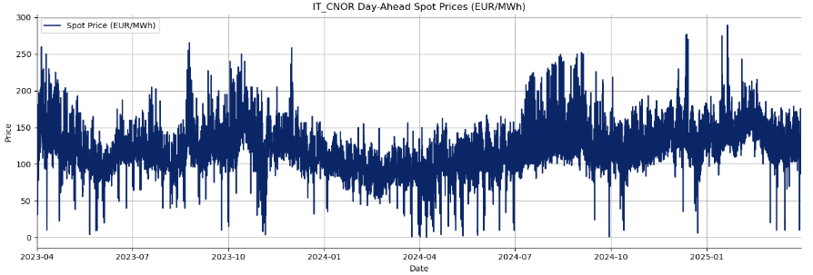
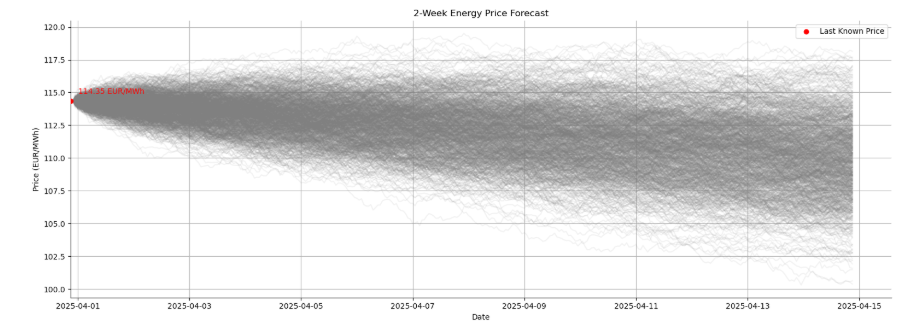

# ⚡GridQuant
European market **spot price forecasts** via Monte Carlo analysis and Geometric Brownian Motion.  

## Overview
Today, with cloud storage and AI placing unprecedented strain on the grid, energy security and building operational costs are not only an urban planning concern but a growing business risk. The key contribution of this model is proposing a methodology with which to forecast volatility itself in energy markets.

This python-based package introduces a crucial co-simulation and energy market forecasting method leveraging [Geometric Brownian Motion](https://www.sciencedirect.com/topics/mathematics/geometric-brownian-motion) (GBM) and [Monte Carlo](https://www.sciencedirect.com/science/article/pii/S2212567114004638) (MC) analysis to forecast energy prices with uncertainty in increasingly more volatile energy markets.

The workflow consists of three key stages:
1. **Data Retrival** — Historical hourly energy spot prices from bidding zones in the European Union are accessed via the [European Network of Transmission System Operators for Electricity](https://www.entsoe.eu/) (ENTSOE) API.
2. **Empirical Volatility Calculation** — The model computes both hourly and annualized volatility based on historical spot prices, forming the foundation of the stochastic price predictions.
3. **Stochastic Forecast Simulation** — The model performs Monte Carlo simulations based on GBM dynamics to generate forward-looking energy price scenarios and uncertainty bounds.

## Installation
`python3 -m pip install entsoe-py`

*NOTE: To use `EntsoeRawClient` you will need to request your own API key by emailing [transparency@entsoe.eu](transparency@entsoe.eu).*

## ⚒️Case Study: Northern Italy
The following case study of Italy's IT_CNOR bidding zone, located in the northern region of the country, forecasts day-ahead prices for the first two weeks of May 2025 using 2 years of historical data from April 2023 to 2025.
The historical hourly electricity spot price data pulled by GridQuant shows a stable electricity market in comparison with many other European energy markets:

<p align="center">
  
</p>

The two-week energy price forecast also indicates a slight decrease in energy prices. However, it is important to note that the GBM model is only accurate for short-term forecasts of roughly two weeks and assumes that the historical dataset is normally distributed. In reality, electricity prices are rarely—if ever—normally distributed and tend to be right-skewed. Future iterations of the model could improve forecast accuracy by incorporating backtesting, accommodating alternative distribution types, and adjusting historical data for inflation.

<p align="center">
  
</p>

## Methodology & Usage
Run `GridQuant.py` on your local machine (duh). A full list of ENTSOE country codes and their associated timezones can be found in `CountryCodes.csv` for your convinience.

*For guidance on using the ENTSO-E API, refer to the [entsoe-py](https://github.com/EnergieID/entsoe-py) documentation.*

### Inputs
This is the default input used for the example case below. The API call will work for any other bidding zone or number of years analyzed as long as it is available on the ENTSOE database.

```python
# Desired Location/Bidding Zone
country_code = 'IT_CNOR' 
time_zone = 'Europe/Rome'

# Historical Data Window
end_year = 2025
month = 4 
num_years = 2
```
In this example, the spot price data for on of Italy's bidding zones, IT_CNOR, is pulled from April 2023 to April 2025.

### Annualized Volatility Calculation
To calculate log returns, we must first drop all historical spot prices \( P_t < 0 \).  
Then, the log return formula is applied:
```math
\text{Log Return} = \ln\left(\frac{P_t}{P_{t-1}}\right)
```

Then, σ (the standard deviation of log returns) is calculated for the time interval, where \( N \) is the number of hourly spot prices available in our dataset (to accommodate for incompleteness or inconsistencies in real data).

```math
\text{Annualized Volatility} = \sigma_{\text{interval}} \times \sqrt{N}
```
<br>

```python
# Drop null or zero columns
zero_prices = df[df['price_EUR_per_MWh'] == 0]
print(zero_prices) # This is just so you can do a quick gut check
df = df[df['price_EUR_per_MWh'] > 0]  # Remove zero or negative prices

# Calculate log returns
df['log_return'] = np.log(df['price_EUR_per_MWh'] / df['price_EUR_per_MWh'].shift(1))

# Drop NaN
df.dropna(inplace=True)

# Hourly volatility (standard deviation of returns)
hourly_vol = df['log_return'].std()

annualize_factor = df.shape[0]/num_years #normally this would be based on the number of hours in a given trading year. However, given that there are inconsistancies in the data, it is better to simply divide # of observations
annualized_vol = hourly_vol * np.sqrt(annualize_factor)

print(f"Hourly volatility: {hourly_vol:.6f}")
print(f"Annualized volatility: {annualized_vol:.6f}")
```
### Forecasting With Uncertainty
The GBM model provides a mathematical foundation for simulating future energy price paths by defining how prices evolve over time based on historical drift (𝜇) and volatility (𝜎). Our historical dataset provides both of these values. 𝜇 is set equal to the averge hourly historical log return and the 𝜎 is set to our hourly volatility. We opt for using hourly volality over the annualized volatility because our 2-week forecast will be hourly as well. Each new hourly price is based on the previous price and modified via the following equation:

The GBM model provides a mathematical foundation for simulating future energy price paths by defining how prices evolve over time based on historical drift (𝜇) and volatility (𝜎). Our historical dataset provides both of these values: 𝜇 is set equal to the average hourly historical log return, and 𝜎 is set to our hourly volatility. We opt for using hourly volatility instead of annualized volatility because our two-week forecast is also hourly. Each new hourly price is based on the previous price and is modified via the GBM equation:

```math
S_{t+\Delta t} = S_t \times e^{\left((\mu - \tfrac{1}{2}\sigma^2)\Delta t + \sigma\sqrt{\Delta t}\,Z\right)}
```
<br>

```python
def gbm_additive(mu, sigma, last_price, num_simulations, dt, steps):
    # Initialize price paths
    simulations = np.zeros((steps, num_simulations))
    simulations[0, :] = last_price

    for t in range(1, steps):
        # Generate random step for each simulation
        price_step = (mu - 0.5 * sigma**2) * dt + sigma * np.random.normal(0, np.sqrt(dt), size=num_simulations)
        # Add step to previous price
        simulations[t, :] = simulations[t-1, :] + price_step

    return simulations
```
The following parameters are used as the default settings for the Monte Carlo simulation:
```python
num_simulations = 1000 
forecast_horizon_days = 14  # maximum days GBM model should be used to forecast
hours_per_day = 24
forecast_horizon_hours = forecast_horizon_days * hours_per_day
np.random.seed(42)  # Simulation seed for reproducibility
```
